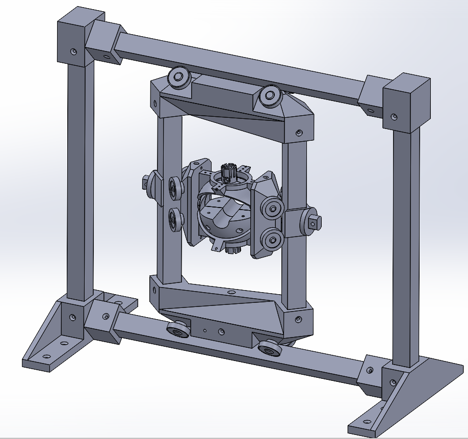
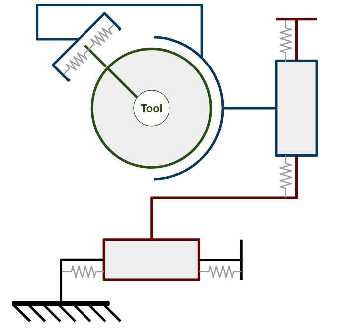

# 3Rplan frame
The following device was designed to evaluate the performance and the limits of the control of a medical robot arm. The movement of the probe had to be constrained in a plane and free to rotate arond any axis. The selected solutionsfor this device are two orthogonal prismatic joints ensure a planar motion while a spherical joint enable all possible rotations. A spherical joint was choosen over three revolute joints to avoid any gimball lock. Each prismatic joint has a range of motion of [-10cm;10cm]. The spherical joint enable a range of rotation of [-30°, 30°] around any axis.   Each joint are constrainted by springs whose stiffness is adjustable.

Preview            |  Schematic
:-------------------------:|:-------------------------:
 |  
